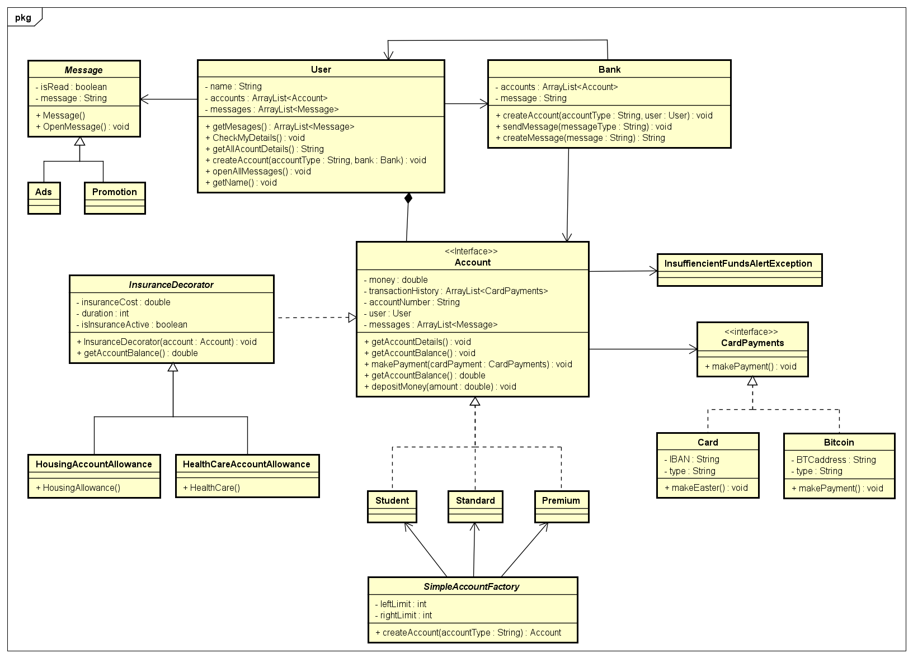

# Design_Patterns-Banking_App

## UML

## Design Patterns

The Following patterns were implemented into this application:

- Factory Design Pattern
- Decorator Design Pattern
- Adapter Design Pattern
- 4th on Design Pattern

**The Factory Design** was used to make the different types of Accounts. All accounts, in theory are the same, but a young child might not have an email address a cell phone. SO int this application it was used to make the various accounts with the same methods, but have different implementations.

**Decorator Pattern** was used 

**The Adapter Design** was used in the CardPayments. The default payment is CardPayments; it requires an IBAN and a payment type. In bitcoin,  there is no IBAN present; a Bitcoin Hash Address is then being adapted to use BTC hash with IBAN.

**4th Design Pattern** was used.....